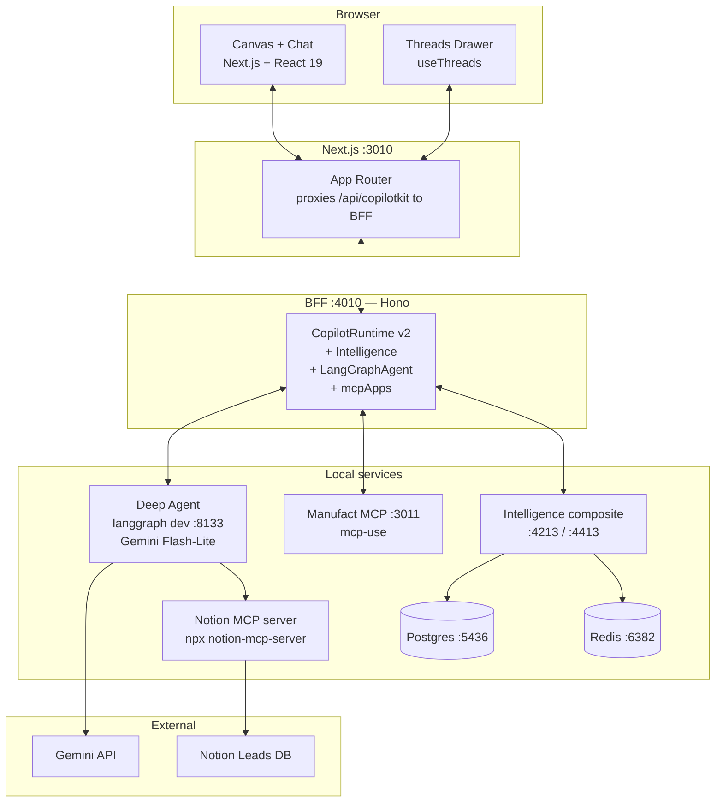
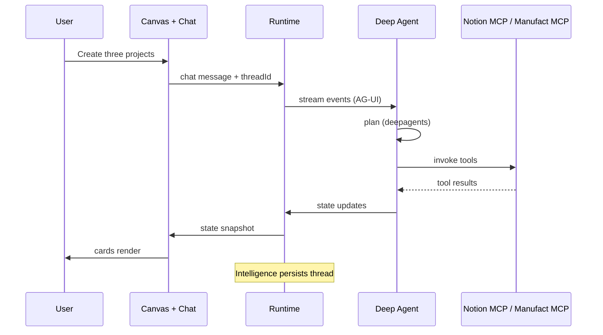

# Architecture

> Default Intelligence/Postgres/Redis ports (`4201` / `4401` / `5432` / `6379`) are remapped to `4213` / `4413` / `5436` / `6382` via `.env` (`APP_API_HOST_PORT`, `REALTIME_GATEWAY_HOST_PORT`, `POSTGRES_HOST_PORT`, `REDIS_HOST_PORT`) so the kit boots cleanly on machines that already run another Intelligence stack. Override them in `.env` to use the originals.

## Why a separate BFF?

The CopilotKit runtime (`@copilotkit/runtime/v2`) bundles express transitively, which Next.js can't tree-shake cleanly inside an App Router API route (the dynamic `require(mod)` in express's view engine breaks turbopack bundling). The kit instead runs the runtime as a Hono BFF on port 4010, and Next.js rewrites proxy `/api/copilotkit/*` to `http://localhost:4010` (configurable via `BFF_URL` in `.env`) so frontend code stays on relative URLs and there's no CORS to manage.
